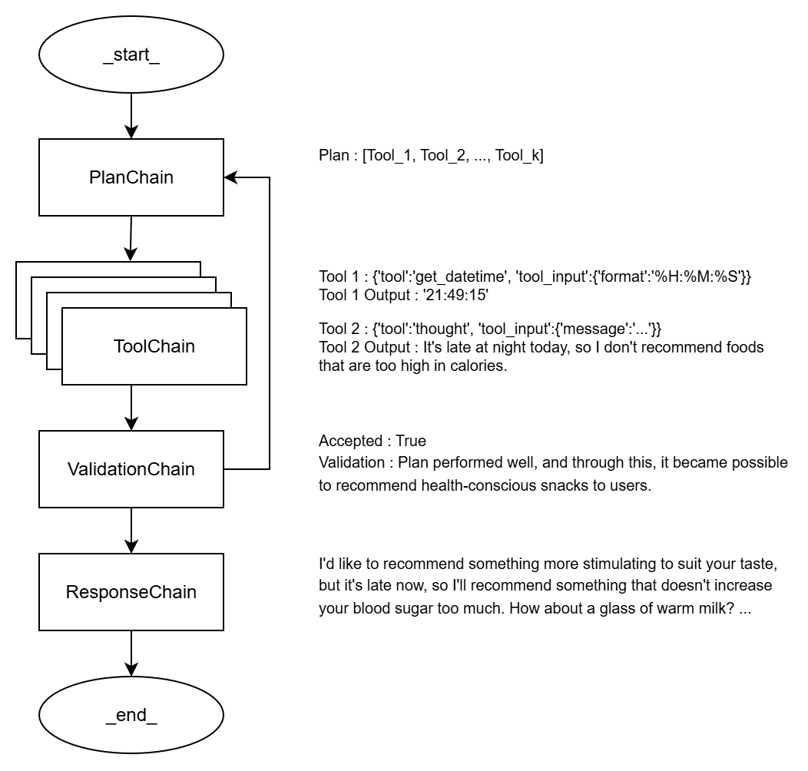

# plan-agent
<figure>
    
</figure>

plan-agent is an AI-powered multilingual text-to-text response generator. It leverages PlanChain and a set of modular tools to answer user queries in a stepwise, explainable manner.

## Main Features & Architecture
### 4-stage reasoning graph
Executes a series of tool permutations created by PlanChain to respond to user queries. The process consists of the following four procedures:
1. PlanChain
    - PlanChain is a chain that devises an appropriate plan for the user's question.
    - Based on the conversation history, it maps out the next actions needed to resolve the current query.
2. ToolChain
    - ToolChain is a chain that, following the previously established plan, selects the proper tool for the current step and executes it to answer the user's question.
3. ValidationChain
    - ValidationChain is a chain that verifies whether the plan for the user's question has been executed correctly.
    - It checks if the plan proceeded as intended and confirms that meaningful results were produced.
    - If the plan was not executed or the results are insignificant, it encourages the system to devise a new plan.
4. ResponseChain
    - ResponseChain is a chain that generates the final answer to the user's question.
    - Drawing on the information and reasoning gathered in the previous stages, it crafts a clear and friendly response.

### Automatically managed memory system
- All conversation history that occurs within the current session is managed by the `Memory` object.
    - If the conversation is prolonged (default: 64000 characters or more), it is summarized by `SummaryChain` to replace the conversation that has been made so far.
    - To ensure that memory can be maintained even if the current session is interrupted, the user can request the graph to store the memory.
- All image files used in the conversation are stored as vectors in `chromadb` along with the context of the conversation in which the image was used.
    - Of course, if the image file is needed again for future conversations, the graph will find the path of the image file from `chromadb` and insert it into the context.

### Multilingual
- By setting `LOCALE` in `.env`, you can change the agent's language system. Please refer to first step of `Usage` below.
    - Tested: 'kr', 'us'

## Supported Tools & Examples
| Tool Name | Description | Example Query |
| -- | ------ | ---- |
| `get_datetime` | Get today's date and current time. LM can tune parameter `format` to only take fo the parts it want. | "What time is it now?" |
| `web_search` | Get top-k(default=4) documents retrieved by `tavily` with query | "Show me today’s US news." |
| `get_user_location` | Get current user's location. Using googlemap. | "Where am I now?" |
| `nearby_search` | Retrieve some nearby places with latitude-longitude . | "Find nearby cafes." |
| `get_image_from_db` | Retrieve an image from DB(Used as image-memory). | "Show me a previously saved image." |
| `get_image_from_screen` | Capture a screenshot image from user's screen. Image will be saved in your local directory. | "Take a screenshot of my screen." |
| `vision_tool` | Get response of `VisionChain`, an implementation of multimodal LM, about inputed query with image. | 	"Describe this image: '\path\to\image.png'" |
| `thought`[^special]           | Not using any particular tools, but simply when you need a thought process. | "How should I solve this problem?" |
| `save_chat_memory`[^special]  | Save the conversation history so far. | "Save our chat history." |
| `clear_chat_memory`[^special] | Clear the conversation history so far. | "I want to reset our conversation to start new chat." |
| `execute_code` | Execute short code in local python environment, then return printed strings or objects. | "Write a Python code to calculate a summation between maximum and minimum value in data list. Make sure it runs successfully in a real Python environment." |

[^special]: Special tool. Function that does not require any tool calling and tool input, and can be resolved inside the code.

## Installation & Setup
1. Python 3.10+ is recommended(Tested python=3.11). Use a virtual environment.
2. Clone this repository.
3. Install dependencies in `requirements.txt` on you virtual environment.
```cmd
pip install -r requirements.txt
```
4. Write your `OPENAI_API_KEY` on `.env`, and optionally `GROQ_API_KEY`, `TAVILY_API_KEY`, `GOOGLE_MAPS_API_KEY`
```text
OPENAI_API_KEY=sk-xxxx
# Optionally: GROQ_API_KEY, TAVILY_API_KEY, GOOGLE_MAPS_API_KEY
```

## Usage
1. Initialize `.env` with executing `setup_env.py`
```cmd
python setup_env.py
```
2. Instantiate a PlanAgent object.
3. Use the chat() method to send queries; the agent will select tools and chains as needed.
```python
from agent.graph import PlanAgent
graph = PlanAgent('demo-1')
response = graph.chat('Show me today’s US news in English.')
print(response)
```

## TODO

- Entity Memory: A dynamic memory for ToolChain.
- Async: Convert most jobs to asynchronous